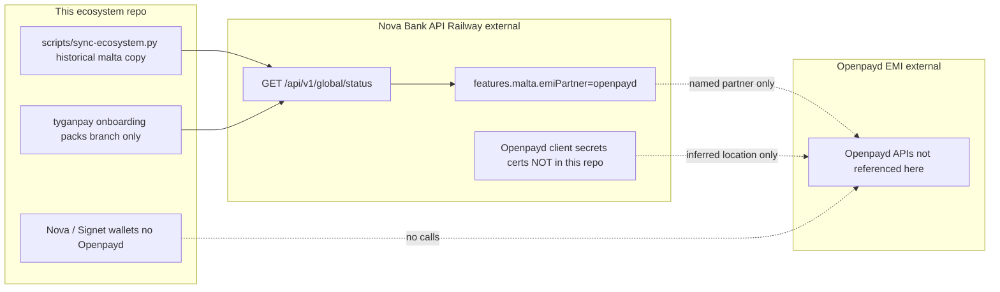

# Openpayd / Malta EMI / IBAN — Complete Integration Handoff Report

**Generated:** 2026-07-20 (updated with ecosystem wiring + setup checklist)  
**Workspace:** Nova Bank ecosystem manifest + Nova/Signet wallets  
**Search coverage:** current working tree; git history; remote branches `origin/cursor/tyganpay-nova-onboarding-205e` and `origin/cursor/tyganpay-readiness-pdf-cd3e`; `.env*` templates; Docker/k8s/Helm/Terraform; CI/CD; docs; scripts; comments; live readonly probe of Nova Bank `GET /api/v1/global/status` and `GET /api/v1/international/integrations`.

**Operational setup (how to wire NestJS/Railway):** [`OPENPAYD-NOVA-BANK-MALTA-SETUP.md`](OPENPAYD-NOVA-BANK-MALTA-SETUP.md) · env template [`.env.example`](../.env.example)

---

## Executive verdict

**There is no OpenPayd HTTP client in this repository.** OpenPayd appears as a **named EMI partner** (`emiPartner: "openpayd"`) for **Nova Bank Malta Ltd** on the live Nova Bank public status endpoint, and as catalog item `id=openpayd` with `configHint: EMI_OPENPAYD_API_KEY` on `GET /api/v1/international/integrations`. This ecosystem repo now mirrors that metadata in `ECOSYSTEM.json` and provides an env/setup checklist. **No settlement IBAN value** and **no live credentials** are present in git — NestJS/Railway must hold secrets.

This document enumerates every discovered item with file and line citations where available, and **explicitly states absences** rather than inventing values.

---

## Scope searched


| Area | Result |
|------|--------|
| Current `main` working tree | **Zero** matches for `openpayd` / `OpenPayd` / `OPENPAYD` / `emiPartner` / Malta EMI in tracked source |
| Branch `origin/cursor/tyganpay-nova-onboarding-205e` | All Openpayd/Malta onboarding artifacts (unmerged) |
| Branch `origin/cursor/tyganpay-readiness-pdf-cd3e` | DSSBOAT IBAN / iFAST GB PDF (not Openpayd) |
| `.env*`, Docker, k8s, Helm, Terraform, OpenAPI/Postman for Openpayd | **Not present** |
| Live probe (readonly): `GET https://nova-bank-api-production-7311.up.railway.app/api/v1/global/status` | Returns `features.malta.emiPartner = "openpayd"` |


---

## 1. Complete `.env` specification for Openpayd

### 1.1 OpenPayd-specific environment variables

Template (empty values only): [`.env.example`](../.env.example). **No runtime consumer in this repo** — NestJS/Railway must load them.


| Variable | Required vs optional | Default | Format / type / example | Files referencing | Services consuming | Dev / staging / UAT / prod |
|----------|----------------------|---------|-------------------------|-------------------|--------------------|----------------------------|
| `EMI_OPENPAYD_API_KEY` | Required on NestJS (Nova catalog hint) | *(none)* | secret string | [`.env.example`](../.env.example), [`docs/OPENPAYD-NOVA-BANK-MALTA-SETUP.md`](OPENPAYD-NOVA-BANK-MALTA-SETUP.md); live catalog `configHint` | NestJS Nova Bank API (Railway) | Same name all envs; value differs |
| `OPENPAYD_USERNAME` | Required on NestJS | *(none)* | OpenPayd portal username | `.env.example` | NestJS OAuth Basic auth | Sandbox vs prod portal users |
| `OPENPAYD_PASSWORD` | Required on NestJS | *(none)* | secret | `.env.example` | NestJS OAuth Basic auth | Sandbox vs prod |
| `OPENPAYD_ACCOUNT_HOLDER_ID` | Required on NestJS | *(none)* | UUID | `.env.example` | NestJS `x-account-holder-id` | Per tenant |
| `OPENPAYD_BASE_URL` | Required on NestJS | `https://sandbox.openpayd.com` | URL | `.env.example` | NestJS HTTP client | Sandbox URL vs production tenant URL |
| `OPENPAYD_ENV` | Recommended | `sandbox` | `sandbox` \| `production` | `.env.example` | NestJS feature flags | See setup matrix |
| `OPENPAYD_ACCOUNT_ID` | Recommended | *(none)* | account id string | `.env.example` | NestJS payments | Per env |
| `OPENPAYD_CLIENT_ID` / `OPENPAYD_REFERRAL_ID` | Optional | *(none)* | UUID | `.env.example` | NestJS linked-client context | Per tenant |
| `OPENPAYD_WEBHOOK_SECRET` | Recommended | *(none)* | secret | `.env.example` | NestJS webhook verify | Per env |
| `OPENPAYD_WEBHOOK_URL` | Recommended | *(none)* | HTTPS URL | `.env.example` | OpenPayd portal + NestJS | Per env |
| `OPENPAYD_SETTLEMENT_IBAN` / `OPENPAYD_SETTLEMENT_BIC` | Ops | *(none)* | IBAN / BIC | `.env.example` | Ops/compliance (not git) | Production settlement |
| Certificate / mTLS paths | N/A | N/A | N/A | **Not present** | **None documented** | OpenPayd public API uses TLS + OAuth; mTLS **not found** in this repo |


**Conclusion:** This repo now ships an **env template + setup checklist**. It still cannot “fully run” OpenPayd because **no OpenPayd client exists here** — secrets and NestJS code live on Railway.

### 1.2 Environment variables that *do* exist in this repository (not Openpayd)

These are listed for completeness so operators do not confuse them with Openpayd configuration.


| Variable | Required? | Default | Type / example | Referenced at | Consumer |
|----------|-----------|---------|----------------|---------------|----------|
| `NOVA_BANK_API` | Optional override | `https://nova-bank-api-production-7311.up.railway.app/api/v1` | URL | [`scripts/fetch-api.sh:5`](../scripts/fetch-api.sh) | Shell fetch helper |
| `GATE_PORT` | Optional | `8787` | number | [`apps/signet/server/gate/index.mjs:4`](../apps/signet/server/gate/index.mjs) | Signet institutional gate |
| `GATE_ACCESS_CODE` | Optional | `signet-institutional` | string | [`apps/signet/server/gate/index.mjs:5`](../apps/signet/server/gate/index.mjs) | Signet gate |
| `VITE_GATE_URL` | Optional | `http://localhost:8787` | URL | [`apps/signet/src/components/security/InstitutionalGate.tsx:7`](../apps/signet/src/components/security/InstitutionalGate.tsx), [`apps/signet/src/vite-env.d.ts:4`](../apps/signet/src/vite-env.d.ts) | Signet UI |
| `VITE_WALLETCONNECT_PROJECT_ID` | Optional for WalletConnect | *(none)* | string | [`apps/nova/src/lib/web3/connect.ts:103`](../apps/nova/src/lib/web3/connect.ts), [`apps/signet/src/lib/web3/connect.ts:99`](../apps/signet/src/lib/web3/connect.ts), [`apps/nova/src/vite-env.d.ts:4`](../apps/nova/src/vite-env.d.ts) | Web3 connect |
| `VITE_BASE` | Optional | `/` | path | [`apps/nova/vite.config.ts:7`](../apps/nova/vite.config.ts), [`apps/signet/vite.config.ts:8`](../apps/signet/vite.config.ts), `.github/workflows/deploy-nova.yml`, `.github/workflows/deploy-production.yml` | Frontend build |


Hardcoded (not env) Nova Bank URLs also appear in current [`scripts/sync-ecosystem.py:17–18`](../scripts/sync-ecosystem.py):

- `NOVA_BANK_UI = "https://nova-bank-api-production-7311.up.railway.app"`
- `NOVA_BANK_API = f"{NOVA_BANK_UI}/api/v1"`

### 1.3 Feature flags / conditional variables related to Malta EMI

**Not present as environment variables** in this repository.

Live Nova Bank API (external to this repo) returns feature flags under `features.malta` and `features.integrationSurface`. Observed via readonly probe on **2026-07-20**:


| Flag (live API) | Value | Meaning for EMI / IBAN |
|-----------------|-------|------------------------|
| `features.malta.entityName` | `Nova Bank Malta Ltd` | Legal entity |
| `features.malta.emiPartner` | `openpayd` | Named EMI partner only |
| `features.malta.vfaLicensed` | `true` | VFA signal |
| `features.malta.liveRailsEnabled` | `true` | API-claimed rails flag |
| `features.malta.institutionApiLive` | `true` | API-claimed |
| `features.malta.cryptoLiveEnabled` | `false` | Crypto not live |
| `features.malta.nrwTestnetOnly` | `true` | NRW testnet only |
| `features.realMoney` | `false` | **Not real-money** |
| `features.integrationSurface.banking.provider` | `sandbox` | Banking sandbox |
| `features.integrationSurface.banking.fineractLive` | `false` | Fineract not live |
| `features.integrationSurface.banking.swiftOauthReady` | `false` | SWIFT OAuth not ready |
| `features.integrationSurface.banking.swiftSandbox` | `true` | SWIFT sandbox |
| `features.integrationSurface.paymentRails.productionLive` | `true` | Claimed; not Openpayd-specific |
| `features.integrationSurface.paymentRails.wiseSandbox` | `true` | Other PSP sandbox |
| `features.integrationSurface.paymentRails.revolutSandbox` | `true` | Other PSP sandbox |


Dev / staging / UAT Openpayd env matrices: **not present** in repository.

### 1.4 `.env` templates and secrets layout

| Artifact | Status |
|----------|--------|
| `.env` | **Not present** (gitignored) |
| `.env.example` | **Not present** (allowed by gitignore via `!.env.example` but file missing) |
| `.env.template` | **Not present** |
| `secrets/`, `.secrets/`, `*.pem` | Ignored by [`.gitignore:17–23`](../.gitignore); **no Openpayd material checked in** |
| Docker Compose / k8s ConfigMaps / Helm values / Terraform vars for Openpayd | **Not present** |
| CI encrypted secrets for Openpayd | **Not present** in [`.github/workflows/`](../.github/workflows/) |


---

## 2. Complete inventory of Openpayd API integrations

### 2.1 REST endpoints called **to** Openpayd


| Item | Status in repository |
|------|----------------------|
| Hosts (`*.openpayd.com` or similar) | **Not found** |
| API version strings for Openpayd | **Not found** |
| SDK / HTTP client for Openpayd | **Not found** |
| Required headers to Openpayd | **Not found** |
| Request / response schemas for Openpayd | **Not found** |
| Idempotency keys / requirements | **Not found** |
| Rate limiting considerations | **Not found** |
| Error handling / retry logic for Openpayd | **Not found** |
| Pagination support | **Not found** |
| File upload / download endpoints to Openpayd | **Not found** |
| Polling mechanisms against Openpayd | **Not found** |
| Openpayd webhooks (inbound handlers) | **Not found** |
| Openpayd event processing | **Not found** |


### 2.2 Related APIs that *mention* Openpayd (Nova Bank + TyganPay — not Openpayd)

These are the only API surfaces tied to the Malta EMI disclosure.


| Method / path | Role | Auth in this repo | Source |
|---------------|------|-------------------|--------|
| `GET /api/v1/global/status` on Nova Bank | Returns `features.malta` including `emiPartner: "openpayd"` | Public (no auth used by sync/docs) | Live API; historical branch `tyganpay/nova-onboarding-pack.json` line 5 (`globalStatusPath`) |
| `GET /api/public/client-onboarding/{token}` on TyganPay | Invite probe (HTTP 423 blocked historically) | Public | Historical `docs/tyganpay-onboarding.md` lines 15–17 |
| `POST /api/public/client-onboarding/{token}` | TyganPay multipart FormData submit | **Not implemented here** | Historical `tyganpay/form-payload.json` line 4 |
| Proposed callback `https://nova-bank-api-production-7311.up.railway.app/api/v1/webhooks/tyganpay` | TyganPay webhook **convention** (“confirm deploy”) | Confirm deploy; **not Openpayd** | Historical `tyganpay/form-payload.json` line 43 |


External Nova Bank OpenAPI (not Openpayd OpenAPI):  
`https://nova-bank-api-production-7311.up.railway.app/api/v1/openapi.json`  
This repository **does not embed** Openpayd OpenAPI or schema files.

### 2.3 Authentication, certificates, secrets, partner endpoints for Openpayd


| Dependency | Present? | Notes |
|------------|----------|-------|
| OAuth credentials | **No** | Not in code, env templates, or CI |
| API keys | **No** | No `OPENPAYD_*` or equivalent |
| mTLS / client certificates | **No** | No cert paths or trust stores |
| Trust stores | **No** | — |
| Signing / encryption keys | **No** | — |
| Certificate paths | **No** | `.gitignore` ignores `*.pem` |
| External Openpayd partner endpoint allowlists | **No** | — |
| Webhook HMAC / signing secrets | **No** | — |


Historical note only (not Openpayd auth): TyganPay form description mentions generic “certificate/passport data” for company KYC (`tyganpay/form-payload.json` line 2 on branch `origin/cursor/tyganpay-nova-onboarding-205e`), not Openpayd mTLS.

---

## 3. Malta EMI / IBAN facts discovered

### 3.1 What the live API discloses (canonical partner signal)

From live `GET https://nova-bank-api-production-7311.up.railway.app/api/v1/global/status` → `features.malta` (observed 2026-07-20):

```json
{
  "entityName": "Nova Bank Malta Ltd",
  "liveRailsEnabled": true,
  "cryptoLiveEnabled": false,
  "institutionApiLive": true,
  "vfaLicensed": true,
  "nrwTestnetOnly": true,
  "emiPartner": "openpayd"
}
```

**No IBAN, BIC, account number, or Openpayd account identifier is returned in this public payload.**

### 3.2 Historical repo copies of that signal (branch only)

All of the following exist only on **`origin/cursor/tyganpay-nova-onboarding-205e`** (not on current `main` unless this handoff file is the sole Openpayd-related addition).


| File | Lines | Content |
|------|-------|---------|
| `ECOSYSTEM.json` | 12–14 | `legalEntity`: `Nova Bank Malta Ltd`; `emiPartner`: `openpayd`; `vfaLicensed`: `true` |
| `ECOSYSTEM.json` | 2748 | `clientEntityFromNovaApi`: `Nova Bank Malta Ltd` |
| `README.md` | 8 | “Legal entity (API): Nova Bank Malta Ltd · EMI partner OpenPayd · VFA signal on live API” |
| `docs/tyganpay-onboarding.md` | 43–58 | Malta entity; OpenPayd EMI partner; EUR / EUROPE / Malta jurisdiction fields |
| `docs/tyganpay-onboarding.md` | 55 | Bank name: “Other / not listed” — **Confirm real IBAN with compliance** |
| `docs/tyganpay-onboarding.md` | 61–67 | Regulatory signals from `features.malta` |
| `docs/tyganpay-onboarding.md` | 75 | Still required: bank account ownership proof (settlement IBAN) |
| `docs/tyganpay-onboarding.md` | 84 | Fill banking IBAN under “Other / not listed” if OpenPayd is not listed |
| `tyganpay/form-payload.json` | 12–14 | `companyLegalName`: Nova Bank Malta Ltd; `jurisdiction`: Malta |
| `tyganpay/form-payload.json` | 38–43 | `bankRegion`: EUROPE; `accountJurisdiction`: Malta; `bankName`: “Other / not listed”; callback URL for TyganPay |
| `tyganpay/form-payload.json` | 50–51 | Source-of-funds / transaction profile text mentioning OpenPayd EMI |
| `tyganpay/form-payload.json` | 75–77 | `novaApiEvidence.emiPartner`: `openpayd` |
| `tyganpay/nova-onboarding-pack.json` | 22–26, 39–43 | Malta entity + `emiPartner`: `openpayd` |
| `tyganpay/nova-onboarding-pack.json` | 60–61 | `bankName`: “OpenPayd (EMI partner) / Other — confirm settlement account with compliance” |
| `tyganpay/nova-onboarding-pack.json` | 90–93 | Missing: registration, passport, bank ownership proof |
| `tyganpay/RESET-REQUEST.md` | 22, 25 | Legal name Malta Ltd; EMI partner (API): OpenPayd |
| `tyganpay/drafts/COMPLIANCE_PACK.md` | 13–15, 27–33 | OpenPayd + `features.malta` signals |
| `tyganpay/drafts/SOURCE_OF_FUNDS_DECLARATION.md` | 8, 17–20, 33 | Fiat rails via OpenPayd; evidence string `emiPartner=openpayd` |
| `tyganpay/drafts/OPTIONAL_SUPPORTING_DOCUMENTS.md` | 10, 18 | Screenshot/export of Malta entity + OpenPayd from status API |
| `scripts/sync-ecosystem.py` | 300–311 | Copies `features.malta` → `ECOSYSTEM.json` `legalEntity` / `emiPartner` / `vfaLicensed` |


**Current branch [`ECOSYSTEM.json`](../ECOSYSTEM.json):** `products.novaBankOnline` includes `legalEntity` / `emiPartner` / `vfaLicensed`; `products.openpayd` holds catalog metadata + `novaConfigHint: EMI_OPENPAYD_API_KEY`.

**Current [`scripts/sync-ecosystem.py`](../scripts/sync-ecosystem.py):** `apply_malta_emi()` refreshes those fields from `GET /api/v1/global/status` (snapshot or live).

### 3.3 Settlement IBAN


| Question | Finding |
|----------|---------|
| Actual Malta EMI IBAN in repo? | **Not present** |
| BIC / SWIFT for Openpayd settlement account? | **Not present** |
| Account holder name for settlement? | Context only: Nova Bank Malta Ltd / Anakatech LLC — **no account number** |
| Instruction in historical docs | “Confirm real IBAN with compliance”; select bank “Other / not listed” if OpenPayd not listed (`docs/tyganpay-onboarding.md` lines 55, 84 on tyganpay branch) |
| `BANK_ACCOUNT_OWNERSHIP_PROOF` | Observed as optional/PENDING on TyganPay UI; **proof document not in repo** |
| IBAN field in `form-payload.json` | **No IBAN value field populated** |


### 3.4 Related IBAN artifacts that are **not** Openpayd


| Artifact | Location | Note |
|----------|----------|------|
| Generic IBAN field types in wallet-integrity patch | `patches/nova-bank-api/wallet-integrity/src/store.interface.ts` lines 11, 27; `in-memory.store.ts` line 67; `accounts-haswallet.snippet.ts` line 9 (tyganpay branch) | NestJS drop-in types `iban?: string` / `iban: string` — **no Openpayd API calls** |
| DSSBOAT IBAN / iFAST GB PDF | `origin/cursor/tyganpay-readiness-pdf-cd3e` → `docs/tyganpay/DSSBOAT-IBAN-IFASTGB-Investigation-Report.pdf` | Commit `51f5a08` states **`IFASTGB_*` credentials are absent** from the repository; PDF title concerns iFAST GB, **not Openpayd** |
| Docs mentioning IBAN / SWIFT generally | Historical `docs/kyc.md:133`, `docs/privacy.md:17`, `docs/protocol.md:38`, `docs/whitepaper.md:30–34` | Product / KYC prose; not Openpayd integration |


### 3.5 Historical TyganPay form fields touching banking (no Openpayd API)

From `tyganpay/form-payload.json` on `origin/cursor/tyganpay-nova-onboarding-205e`:


| Field | Value in pack | Notes |
|-------|---------------|-------|
| `bankRegion` | `EUROPE` | Line 38 |
| `accountJurisdiction` | `Malta` | Line 39 |
| `bankName` | `Other / not listed` | Line 40 — not a live Openpayd account id |
| `currency` | `EUR` | Line 48 |
| `transactionTypes` | `swift_iso20022,s2s_api` | Line 47 — TyganPay rails, not Openpayd REST |
| `callbackUrl` | Nova Bank TyganPay webhook convention | Line 43 — **not** an Openpayd callback |
| Registration / passport / IBAN proof fields | `null` or missing | Incomplete for submission |


---

## 4. Integration architecture (as evidenced)



### 4.1 Sequence of API calls involving Openpayd

**None in this repository.** Observed sequence that *surfaces* the partner name:

1. Client or script calls Nova Bank `GET /api/v1/global/status` (public).
2. Response includes `features.malta.emiPartner = "openpayd"`.
3. Historical sync (tyganpay branch) copies that string into `ECOSYSTEM.json` / TyganPay packs.
4. **No subsequent call to Openpayd.**

### 4.2 Authentication flow

**Not implemented** for Openpayd in this repository. No OAuth token exchange, API-key header injection, or mTLS handshake code exists.

### 4.3 Data flow

| Flow | Status |
|------|--------|
| IBAN issuance from Openpayd | **Not implemented** |
| Payouts / payins via Openpayd | **Not implemented** |
| Linked client / beneficiary sync | **Not implemented** |
| Webhook → ledger update | **Not implemented** for Openpayd |
| Partner name → ecosystem manifest | Historical only (tyganpay branch sync) |

### 4.4 Service dependencies

| Service | Role relative to Openpayd | In this repo? |
|---------|---------------------------|---------------|
| Nova Bank API (Railway) | Publishes `emiPartner: openpayd` on public status | Consumed via URL constants / fetch scripts |
| Openpayd EMI | Named partner; APIs **not referenced** | **No client** |
| Hybx Fineract | Core banking middleware URL in ecosystem / historical packs | URL only; not Openpayd |
| TyganPay | Separate payment-rail onboarding; mentions OpenPayd as bank/EMI text | Historical packs only |
| Nova / Signet wallets | Crypto / Web3 UI | **No Openpayd calls** |

### 4.5 Startup requirements / runtime configuration

| Topic | Finding |
|-------|---------|
| Startup requirements for Openpayd | **None** (no service) |
| Runtime configuration | Partner name only via external Nova status (when queried) |
| Failure modes / retries | **N/A** — no Openpayd client |
| Health checks for Openpayd | **Not present** — current health probes target Nova Bank / NRW / swap / RPC (see [`scripts/sync-ecosystem.py`](../scripts/sync-ecosystem.py) probe section ~382+) |
| Monitoring for Openpayd | **Not present** |
| Logging for Openpayd | **Not present** |

---

## 5. Production-readiness gaps (exhaustive)

Everything below would block treating this repository (or any deployment driven solely from it) as a production Openpayd integration:

1. **Missing entire Openpayd client** — no REST, SDK, or service module.
2. **Missing all `OPENPAYD_*` (or equivalent) env vars** — no `.env` template.
3. **Missing secrets** — API keys, OAuth, webhook HMAC, account IDs.
4. **Missing certificates / mTLS / trust stores**.
5. **Missing Openpayd base URLs** for sandbox and production.
6. **Missing settlement IBAN / BIC** for Nova Bank Malta Ltd / Openpayd.
7. **Missing bank ownership proof** documents.
8. **Missing inbound webhook handlers** for Openpayd events.
9. **Missing outbound payment / linked-client / beneficiary APIs**.
10. **Missing idempotency, rate-limit, retry, pagination** logic for Openpayd.
11. **Missing staging / UAT / prod config matrices**.
12. **Placeholder / incomplete onboarding fields** on historical pack: many `null`s in `tyganpay/form-payload.json` (registration number, address, passport, volumes; no IBAN).
13. **TyganPay invite blocked** historically (HTTP 423 `onboarding_link_view_limit_blocked`) — separate from Openpayd but blocks related onboarding.
14. **Live API contradiction for “production EMI”**: `emiPartner=openpayd` but `realMoney=false`, banking `provider=sandbox`, `fineractLive=false` — production fiat rails via Openpayd are **not evidenced as live** from public status.
15. **Malta / Openpayd metadata was not on `main`** prior to this handoff document — only on unmerged `tyganpay-nova-onboarding-205e` (plus this report).
16. **Wrong repo for NestJS banking**: historical README states this is **not** the Nova Bank NestJS application source — Openpayd implementation, if any, is elsewhere.
17. **No Docker / k8s / Terraform** deployment of an Openpayd worker.
18. **No CI secrets** for Openpayd in [`.github/workflows`](../.github/workflows/).
19. **iFAST GB IBAN PDF** documents a different provider track; does not supply Openpayd credentials.
20. **Stub / mock Openpayd services**: **not found** (absence of stubs still means integration incomplete — nothing to promote).

---

## 6. Explicit “not present” checklist (requested categories)

| Category | Present in this repository? |
|----------|-----------------------------|
| Every env var used for Openpayd | **None exist** |
| Required vs optional Openpayd vars | **N/A — none defined** |
| Default values for Openpayd vars | **N/A** |
| Expected formats / examples for Openpayd vars | **N/A** |
| Files referencing each Openpayd var | **N/A** |
| Services consuming each Openpayd var | **N/A** |
| Dev / staging / UAT / production Openpayd vars | **Not present** |
| Openpayd feature flags as env vars | **Not present** (flags exist only on external Nova status API) |
| Every REST endpoint used against Openpayd | **None** |
| Auth / authorization methods to Openpayd | **None** |
| Openpayd API versions | **Not present** |
| Required headers for Openpayd | **Not present** |
| Request / response schemas for Openpayd | **Not present** |
| Idempotency requirements | **Not present** |
| Rate limiting considerations | **Not present** |
| Error handling / retry for Openpayd | **Not present** |
| Openpayd webhooks / callbacks | **Not present** |
| Openpayd event processing | **Not present** |
| Polling mechanisms | **Not present** |
| Pagination support | **Not present** |
| File upload / download to Openpayd | **Not present** |
| Certificates / mTLS / OAuth / API keys / signing keys | **Not present** |
| Settlement IBAN for Malta EMI | **Not present** |

---

## 7. Where to look next (outside this repository)

These locations are **inferred from repo statements**, not verified as containing Openpayd code in this workspace:

| Location | Why |
|----------|-----|
| Nova Bank NestJS application / Railway deployment secrets | This ecosystem README (tyganpay branch) states this repo is **not** that NestJS app; live status claims `emiPartner: openpayd` |
| Compliance / ops for settlement IBAN | Historical onboarding doc: “Confirm real IBAN with compliance” |
| Openpayd partner portal / credentials vault | No credentials stored here |

---

## Document control

| Item | Value |
|------|-------|
| Report path | [`docs/OPENPAYD-MALTA-EMI-HANDOFF.md`](OPENPAYD-MALTA-EMI-HANDOFF.md) |
| Invented Openpayd integration code | **None** — absences documented explicitly |
| Invented IBAN / secrets | **None** |
