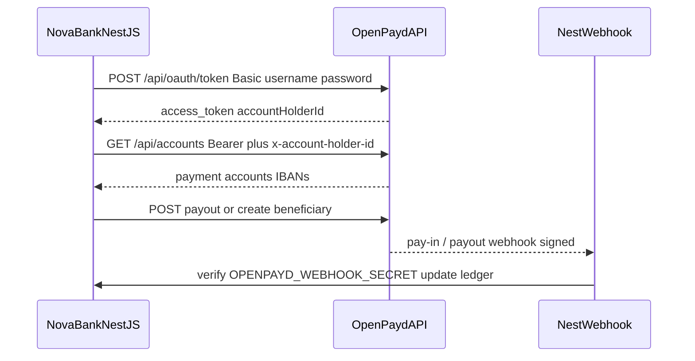

# OpenPayd setup for Nova Bank Malta Ltd

Operational setup guide for the EMI partnership already disclosed on the live Nova Bank API.

| Item | Value |
|------|--------|
| Legal entity | **Nova Bank Malta Ltd** |
| EMI partner (API) | **openpayd** |
| Catalog id | `openpayd` (`domain: emi_banking`) |
| Catalog config hint | `EMI_OPENPAYD_API_KEY` |
| This repo role | Ecosystem metadata + env template + docs |
| Implementation host | **Nova Bank NestJS API on Railway** (not this wallet/docs monorepo) |

Related: [`OPENPAYD-MALTA-EMI-HANDOFF.md`](OPENPAYD-MALTA-EMI-HANDOFF.md) (inventory of absences) · [`.env.example`](../.env.example)

---

## 1. What is already live (public Nova Bank API)

### 1.1 Malta EMI signal

```bash
curl -sS https://nova-bank-api-production-7311.up.railway.app/api/v1/global/status \
  | python3 -c 'import sys,json; print(json.dumps(json.load(sys.stdin)["features"]["malta"], indent=2))'
```

Expected shape:

```json
{
  "entityName": "Nova Bank Malta Ltd",
  "liveRailsEnabled": true,
  "cryptoLiveEnabled": false,
  "institutionApiLive": true,
  "vfaLicensed": true,
  "nrwTestnetOnly": true,
  "emiPartner": "openpayd"
}
```

### 1.2 International integrations catalog

```bash
curl -sS https://nova-bank-api-production-7311.up.railway.app/api/v1/international/integrations \
  | python3 -c 'import sys,json; d=json.load(sys.stdin); print(json.dumps(next(i for i in d["items"] if i["id"]=="openpayd"), indent=2))'
```

Observed catalog entry:

| Field | Value |
|-------|--------|
| `id` | `openpayd` |
| `name` | `OpenPayd` |
| `domain` | `emi_banking` |
| `regions` | `EU`, `UK` |
| `capabilities` | `sepa`, `account_iban`, `multi_currency`, `swift_mt` |
| `access` | `direct_api` |
| `readiness` | `gateway_ready` |
| `configHint` | **`EMI_OPENPAYD_API_KEY`** |
| `pass` | `true` |

### 1.3 Important production caveat

As of the last handoff probe, the same status payload also showed:

- `features.realMoney = false`
- `features.integrationSurface.banking.provider = sandbox`
- `features.integrationSurface.banking.fineractLive = false`

So OpenPayd is **named and catalogued**, but public status does **not** prove live real-money OpenPayd rails yet. Wiring credentials on Railway is required before production settlement.

---

## 2. What this ecosystem repository does

| Deliverable | Path |
|-------------|------|
| Malta fields on Nova Bank Online | `ECOSYSTEM.json` → `products.novaBankOnline.legalEntity` / `emiPartner` / `vfaLicensed` |
| OpenPayd product block | `ECOSYSTEM.json` → `products.openpayd` |
| Sync from live API | `scripts/sync-ecosystem.py` → `apply_malta_emi()` |
| Env template | [`.env.example`](../.env.example) |
| Exhaustive absence inventory | [`OPENPAYD-MALTA-EMI-HANDOFF.md`](OPENPAYD-MALTA-EMI-HANDOFF.md) |

Refresh:

```bash
npm run sync:ecosystem
```

---

## 3. NestJS / Railway OpenPayd integration

The NestJS Nova Bank application is **not** checked out here. A drop-in module for that service ships in this repo:

| Artifact | Path |
|----------|------|
| NestJS patch | [`patches/nova-bank-api/openpayd-emi/`](../patches/nova-bank-api/openpayd-emi/) |
| Install README | [`patches/nova-bank-api/openpayd-emi/README.md`](../patches/nova-bank-api/openpayd-emi/README.md) |

```bash
# Into nova monorepo NestJS API
mkdir -p apps/api/src/openpayd
cp -R patches/nova-bank-api/openpayd-emi/src/* /path/to/nova/apps/api/src/openpayd/
# then OpenPaydModule.register() in app.module.ts — see patch README
```

Use the credentials + wiring checklist below on Railway after copying the patch.

### 3.1 Official OpenPayd API surface

- Docs: https://apidocs.openpayd.com/
- Sandbox host: `https://sandbox.openpayd.com`
- Auth: OAuth2 `client_credentials` with HTTP Basic (`username:password` base64) → Bearer token
- Account context header: `x-account-holder-id: <UUID>`
- Typical resources: accounts, beneficiaries, payments/payouts, webhooks, linked clients

Example token request (sandbox):

```bash
curl -X POST \
  'https://sandbox.openpayd.com/api/oauth/token?grant_type=client_credentials' \
  -H "Authorization: Basic $(printf '%s:%s' "$OPENPAYD_USERNAME" "$OPENPAYD_PASSWORD" | base64 -w0)" \
  -H 'Content-Type: application/x-www-form-urlencoded'
```

### 3.2 Required secrets (Railway / NestJS `.env`)

Copy [`.env.example`](../.env.example) into the NestJS deployment and fill:

| Variable | Required | Source |
|----------|----------|--------|
| `EMI_OPENPAYD_API_KEY` | **Yes** (Nova catalog hint) | OpenPayd / NestJS mapping for catalog `configHint` |
| `OPENPAYD_USERNAME` | **Yes** | OpenPayd partner portal |
| `OPENPAYD_PASSWORD` | **Yes** | OpenPayd partner portal |
| `OPENPAYD_ACCOUNT_HOLDER_ID` | **Yes** | OAuth response `accountHolderId` |
| `OPENPAYD_BASE_URL` | **Yes** | Sandbox or production tenant URL |
| `OPENPAYD_ENV` | Recommended | `sandbox` or `production` |
| `OPENPAYD_ACCOUNT_ID` | Recommended | Default EUR payment account |
| `OPENPAYD_WEBHOOK_SECRET` | Recommended | Webhook signing |
| `OPENPAYD_WEBHOOK_URL` | Recommended | Public NestJS callback URL |
| `OPENPAYD_SETTLEMENT_IBAN` / `BIC` | Ops / compliance | Portal + bank ownership proof |

**No secret values are stored in this git repository.**

### 3.3 Suggested NestJS call sequence



Minimum production modules on the NestJS side (implement there, not here):

1. Token client with refresh before `expires_in`
2. Accounts + IBAN resolve for Nova Bank Malta Ltd
3. Beneficiary create / payout with idempotency key
4. Webhook receiver + signature verification
5. Feature flag: only route real money when `OPENPAYD_ENV=production` and banking provider is not sandbox
6. Health probe that fails closed if token or account holder is missing

### 3.4 Railway checklist

1. Open OpenPayd partner portal → create/confirm **Nova Bank Malta Ltd** business account holder.
2. Create sandbox API user → copy username/password → set Railway variables from `.env.example`.
3. Call OAuth → store `accountHolderId` as `OPENPAYD_ACCOUNT_HOLDER_ID`.
4. Create EUR account → record `OPENPAYD_ACCOUNT_ID` + settlement IBAN/BIC (compliance vault, not git).
5. Register webhook URL on NestJS (`/api/v1/webhooks/openpayd` or the path your NestJS app exposes).
6. Set `EMI_OPENPAYD_API_KEY` to whatever the NestJS OpenPayd module expects for the catalog hint (may be the same as a portal API key or a NestJS-internal alias — confirm in NestJS source).
7. Flip NestJS banking provider from sandbox to OpenPayd only after sandbox pay-in/payout + webhook verification succeed.
8. Re-check `GET /api/v1/global/status` until `realMoney` / banking provider reflect production intent.

### 3.5 Dev / staging / UAT / production matrix

| Env | `OPENPAYD_BASE_URL` | `OPENPAYD_ENV` | Real money |
|-----|---------------------|----------------|------------|
| Development | `https://sandbox.openpayd.com` | `sandbox` | No |
| Staging / UAT | `https://sandbox.openpayd.com` (or OpenPayd UAT tenant if issued) | `sandbox` | No |
| Production | Production tenant URL from OpenPayd | `production` | Yes — only after compliance + NestJS cutover |

---

## 4. Settlement IBAN (Malta EMI)

| Item | Status in this repo |
|------|---------------------|
| Settlement IBAN | **Not present** — obtain from OpenPayd portal / compliance |
| BIC | **Not present** |
| Bank ownership proof | Required for partner onboarding packs; store outside git |

When IBAN is known, put it in Railway/ops secret store as `OPENPAYD_SETTLEMENT_IBAN` (see `.env.example`). Do not commit it.

---

## 5. Verification commands (this repo)

```bash
# Malta + OpenPayd product blocks present
python3 -c 'import json; p=json.load(open("ECOSYSTEM.json"))["products"]; print(p["novaBankOnline"].get("emiPartner"), p["openpayd"]["novaConfigHint"])'

# Live API still names OpenPayd
curl -sS https://nova-bank-api-production-7311.up.railway.app/api/v1/global/status \
  | python3 -c 'import sys,json; print(json.load(sys.stdin)["features"]["malta"]["emiPartner"])'
```

Railway / NestJS (on that host, after secrets are set):

```bash
# Must NOT print secrets; only confirms vars exist
test -n "$OPENPAYD_USERNAME" && test -n "$OPENPAYD_PASSWORD" && test -n "$OPENPAYD_ACCOUNT_HOLDER_ID" && echo "OpenPayd core env present"
```

---

## 6. Still blocked until Railway secrets + deploy

1. Copy [`patches/nova-bank-api/openpayd-emi`](../patches/nova-bank-api/openpayd-emi) into NestJS and deploy to Railway.
2. Real `EMI_OPENPAYD_API_KEY` / OAuth credentials in Railway (not in git).
3. Settlement IBAN + ownership proof for Nova Bank Malta Ltd.
4. Webhook URL registered in OpenPayd portal + `OPENPAYD_WEBHOOK_SECRET` set.
5. Implement `OpenPaydLedgerHook` against the Nova ledger.
6. Public status leaving `banking.provider=sandbox` / `realMoney=false` when intentionally going live.
